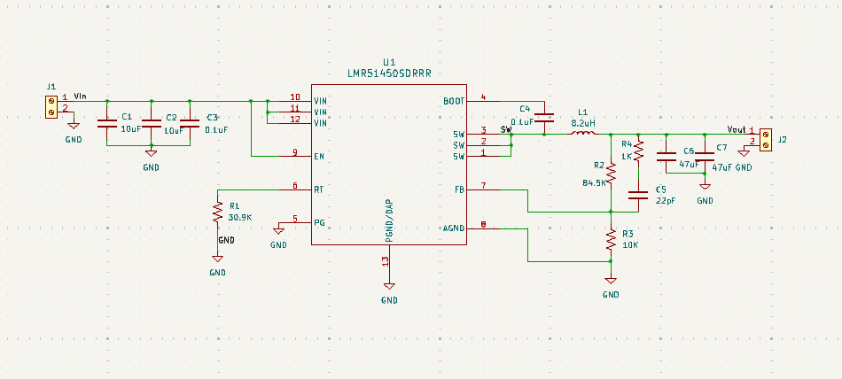
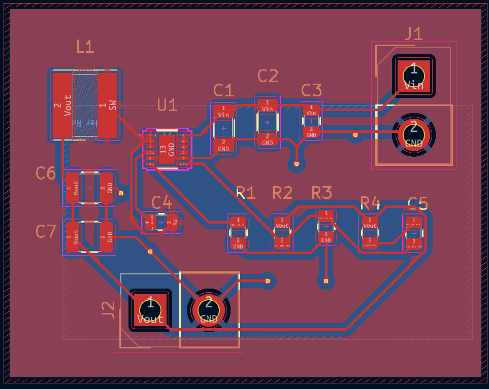

# LMR51450 Based 7.6V, 4A DC-DC Buck Converter

A 2-layer PCB design for a synchronous step-down (buck) converter based on the Texas Instruments' LMR51450. This project is designed to be a power supply for general-purpose electronics, capable of operating over a wide input voltage range.

## Key Specifications

| Parameter | Value |
| :--- | :--- |
| **Input Voltage** | 4V to 36V DC |
| **Output Voltage** | 7.6V DC |
| **Maximum Output Current** | 4A |
| **Switching Frequency** | 500 kHz |
| **IC** | LMR51450SDRRR |

## Hardware

The design is revolves around the LMR51450 IC and a power inductor suitable for the required current.

* **Main Controller IC:** Texas Instruments `LMR51450SDRRR` (36V, 5A Synchronous Buck Converter)
* **Power Inductor:** Wurth Elektronik `7443845030082` (8.2µH, 6.2A I<sub>rms</sub>, 9.5A I<sub>sat</sub>)
* **Input/Output Connectors:** 2-Position, 5.08mm Pitch Screw Terminals

A complete list of all components, including specific part numbers for resistors and capacitors, is available in the Bill of Materials.

## Key Design Equations

The primary component values were determined using the following formulas from the LMR51450 datasheet.

#### Output Voltage Resistor Divider

The output voltage ($V_{OUT}$) is set by the feedback resistors $R_{FBT}$ and $R_{FBB}$ based on the internal 0.8V reference ($V_{REF}$).

$$
R_{FBT} = \frac{(V_{OUT} - V_{REF})}{V_{REF}} \times R_{FBB}
$$

#### Inductor Selection

The minimum inductance ($L_{MIN}$) is calculated based on the maximum input voltage, desired output current, and a chosen inductor ripple current factor ($K_{IND}$, typically 0.2-0.4).

$$
L_{MIN} = \frac{V_{IN\_MAX} - V_{OUT}}{I_{OUT} \times K_{IND}} \times \frac{V_{OUT}}{V_{IN\_MAX} \times f_{SW}}
$$

#### Output Capacitor Selection

The output capacitance ($C_{OUT}$) is chosen to meet requirements for both output voltage ripple and transient response during a load step.

* **Ripple based on ESR:**

    ```math
    \Delta V_{OUT\_ESR} = \Delta i_{L} \times ESR
    ```

* **Ripple based on Capacitance:**
  
    ```math
    \Delta V_{OUT\_C} = \frac{\Delta i_{L}}{8 \times f_{SW} \times C_{OUT}}
    ```

* **Minimum Capacitance for Transient Response:**

    ```math
    C_{OUT} > \frac{1}{2} \times \frac{6 \times (I_{OH} - I_{OL})}{f_{SW} \times \Delta V_{OUT\_SHOOT}}
    ```

## Design Files

This repository contains all the necessary files to review and manufacture the project, designed in KiCad.

* **`Buck_Converter.kicad_sch`**: The main schematic file.
* **`Buck_Converter.kicad_pcb`**: The final 2-layer PCB layout file.
* **`Buck_Converter.csv`**: The complete Bill of Materials (BOM) with manufacturer part numbers.
* **`Buck_Converter_BOM.pdf`**: Bill of Materials (BOM) in pdf format.
* **`Media/`**: A folder containing screenshots of the final schematic and PCB layout.

## Design Notes & Layout Strategy

This project was designed with a focus on robustness and performance, following best practices for switching power supply layout.

* **Wide Input Range:** The components, particularly the 8.2µH inductor, were selected to ensure stable operation across the full input voltage range of the IC (up to 36V).
* **2-Layer Design:**
    * **Top Layer (`F.Cu`):** All components are placed on the top layer. High-current paths (`VIN`, `VOUT`, `SW`) are implemented as wide copper pours to minimize resistance, inductance, and thermal stress. A "filler" ground pour is also used for additional shielding.
    * **Bottom Layer (`B.Cu`):** The entire bottom layer is dedicated to a solid, continuous ground plane. This provides a low-impedance return path for currents, which is critical for stability and low noise (EMI).
* **Thermal Management:** A dense grid of thermal vias is placed directly on the central thermal pad of the LMR51450 IC, connecting it to the bottom ground plane to effectively dissipate heat. Additional "stitching" vias are used throughout the board to strongly connect the top and bottom ground planes.
* **Routing:** All high-current connections were made with copper pours. Only the low-power signal traces for the feedback network were routed as thin traces.

## Media

*(**Instructions:** Replace these placeholders with your final screenshots inside the `Media` folder.)*

**Schematic:**


**PCB Layout (Top and Bottom Layers):**



